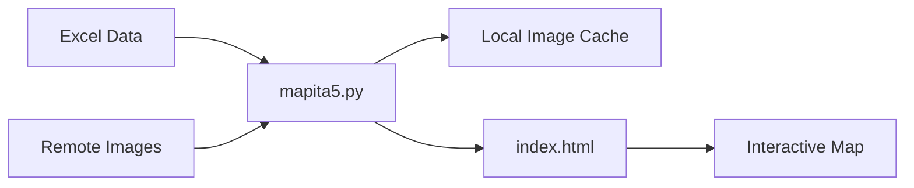

## Introduction

Historia Para Gandules uses **Folium**, a powerful Python library that creates interactive Leaflet.js maps, to visualize historical content locations across the Canary Islands. The maps display markers for each reel/post location with embedded thumbnails and links.

## Architecture

The map system consists of three main components:

1. **Data Source**: Excel files containing location data, images, and post information
2. **Map Generation**: Python script (`mapita5.py`) that processes data and creates the map
3. **Output**: Static HTML file (`index.html`) with an interactive map

### Technology Stack

- **Folium**: Python library for creating Leaflet.js maps
- **Pandas**: Data processing and Excel file reading
- **Requests**: Image downloading and caching

## Data Structure

The Excel source file (`excel_info_1.xlsx`) contains the following columns:

| Column | Description | Example |
|--------|-------------|----------|
| `Localización` | Coordinates in "lat,lon" format | `28.1235,-15.4362` |
| `URL de imagen` | Direct URL to the reel thumbnail | `https://...` |
| `Texto del reel` | Reel caption/description | Historical content text |
| `URL del Post` | Link to the Instagram post | `https://instagram.com/...` |

## Map Features

### Interactive Markers

Each location is marked with a clickable marker that displays:
- A title extracted from the reel text
- A locally cached thumbnail image (200px width)
- A link to view the original Instagram post

### Base Map Configuration

The map is centered on the Canary Islands:
- **Center coordinates**: 28.0° N, 15.0° W
- **Initial zoom level**: 6 (archipelago view)
- **Base layer**: OpenStreetMap tiles

## Workflow



1. Read Excel file with location and content data
2. Download and cache images locally in `imagenes/` folder
3. Parse coordinates from location strings
4. Create Folium map with markers and popups
5. Generate static HTML output

## Getting Started

To generate a map:

```bash
python source/mapita5.py
```

This creates:
- `imagenes/` folder with cached thumbnails
- `index.html` with the interactive map

## Next Steps

- [Map Generation Process](/maps/generation) - Detailed walkthrough of the generation script
- [Customization Guide](/maps/customization) - Learn how to customize markers, popups, and styling
