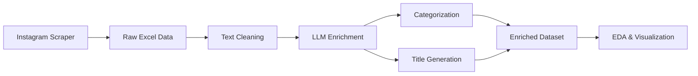

## Overview

The Historia Para Gandules data processing pipeline transforms raw scraped Instagram data into enriched, analyzable datasets. The pipeline consists of three main stages:

1. **Data Collection** - Scraping Instagram content
2. **Data Enrichment** - Categorization and title generation using LLMs
3. **Data Analysis** - Statistical analysis and visualization

## Pipeline Architecture



## Data Flow

### 1. Raw Data Collection

The initial dataset contains scraped Instagram reel data with the following fields:

- **Fecha** - Publication date
- **Texto del reel** - Post caption text
- **Likes** - Number of likes
- **Comentarios** - Number of comments
- **Visualizaciones** - View count
- **Duración del video (s)** - Video duration in seconds
- **Localización** - Geographic coordinates (latitude, longitude)
- **URL del Post** - Instagram post URL
- **URL del video** - Video file URL
- **URL de imagen** - Thumbnail image URL

### 2. Text Preprocessing

Before LLM enrichment, the text data undergoes cleaning:

```python
import re

def eliminar_emojis(texto):
    # Remove emojis using regex pattern
    emoji_pattern = re.compile("["
                          u"\U0001F600-\U0001F64F"  # Emoticons
                          u"\U0001F300-\U0001F5FF"  # Symbols & pictographs
                          u"\U0001F680-\U0001F6FF"  # Transport symbols
                          # ... additional emoji ranges
                          "]+", flags=re.UNICODE)
    return emoji_pattern.sub(r'', texto)

# Extract hashtags
def extraer_hashtags(texto):
    texto_sin_emojis = eliminar_emojis(texto)
    lista_hashtags = re.findall(r'#(\w+)', texto_sin_emojis)
    return str(lista_hashtags)
```

### 3. LLM-Powered Enrichment

The cleaned text is processed through OpenAI's GPT-3.5-turbo for:

- **Categorization** - Classifying content into historical themes
- **Title Generation** - Creating engaging social media titles

See [Data Enrichment](/processing/enrichment) for details.

### 4. Analysis & Visualization

The enriched dataset enables:

- Statistical analysis of engagement metrics
- Category-wise performance comparison
- Geographic distribution analysis
- Temporal trend identification

## Data Format

### Input Format

Raw data is stored in Excel format (`excel_info_1.xlsx`, `excel26deenero.xlsx`) with 121 rows representing historical content posts.

### Output Format

Enriched data includes additional fields:

- **Texto limpio** - Cleaned text without emojis
- **Hashtags** - Extracted hashtag list
- **Categoria** - AI-assigned category
- **Titulo** - AI-generated engaging title

## Processing Statistics

<Info>
**Dataset Size**: 121 Instagram reels

**Date Range**: February 2024 - December 2024

**Processing Time**: ~2-3 minutes for full enrichment
</Info>

### Key Metrics

```python
# Descriptive statistics from the dataset
df[['Likes', 'Comentarios', 'Visualizaciones', 'Duración del video (s)']].describe()
```

| Metric | Mean | Std | Min | Max |
|--------|------|-----|-----|-----|
| Likes | 1,316 | 1,930 | 304 | 14,659 |
| Comentarios | 39 | 49 | 3 | 361 |
| Visualizaciones | 15,392 | 39,250 | 2,277 | 337,001 |
| Duración (s) | 50.1 | 18.2 | 26.0 | 133.5 |

## Usage Example

Here's how the complete pipeline is executed:

```python
import pandas as pd
from openai import OpenAI

# 1. Load raw data
df = pd.read_excel('excel_info_1.xlsx')

# 2. Clean text
df['Texto limpio'] = df['Texto del reel'].apply(eliminar_emojis)
df['Hashtags'] = df['Texto limpio'].apply(extraer_hashtags)

# 3. Enrich with LLM
client = OpenAI(api_key="your-api-key")
df['Categoria'] = df['Texto limpio'].apply(clasificartexto)
df['Titulo'] = df['Texto limpio'].apply(crear_titulo_redes_sociales)

# 4. Save enriched data
df.to_excel('excel_enriched.xlsx', index=False)
```

## Next Steps

<CardGroup cols={2}>
  <Card title="Geolocation Processing" icon="map-location-dot" href="/processing/geolocation">
    Learn how coordinates are extracted and parsed
  </Card>
  <Card title="Data Enrichment" icon="wand-magic-sparkles" href="/processing/enrichment">
    Understand the LLM categorization process
  </Card>
</CardGroup>
